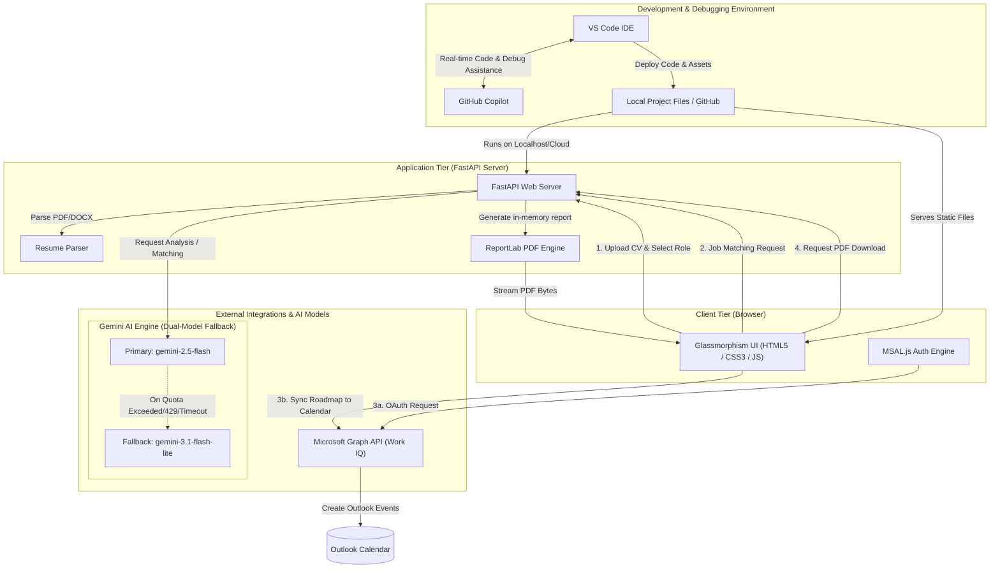

# ✈️ CareerPilot AI — FAANG-Grade Career Coach & Outlook Scheduler

## 🏆 Hackathon Submission

**CareerPilot AI** was developed as a submission for the **Microsoft AI Skills Fest 2026 – Agents League Hackathon (Track 1: Creative App)**.
### 🔗 Live Demo
https://shehrazsarwar-careerpilotai.hf.space/

CareerPilot AI is a premium, high-fidelity career growth dashboard that analyzes your resume, evaluates competency alignments for target roles, provides tailored up-skilling roadmaps, recommends certifications & projects, and **schedules learning items directly into your Microsoft Outlook Calendar**.

---

## 🌟 Premium Features

1. **Aesthetic Aurora Dashboard**: Built using vanilla CSS with modern dark-mode glassmorphism cards, mesh background gradients, and micro-interactions.
2. **Automated Skill-Gap Analyzer**: Instantly identifies missing technical competencies and charts them alongside your core strengths.
3. **Targeted Roadmap Timeline**: Generates a complete 30-60-90 day timeline containing targeted milestones to make you job-ready.
4. **Interview Prep accordion**: Provides tailored behavioral and technical questions matching your profile, with corresponding response strategies.
5. **Job Matcher Compatibility Gauge**: Paste any job description to compare your CV alignment and get bulleted tailoring recommendations.
6. **Microsoft Work IQ Calendar Sync**: Authenticate with your Microsoft account (work/school or personal) to automatically schedule roadmap items to your Outlook Calendar (spaced weekly at 9 AM starting today).
7. **Gemini API Dual-Model Failover**: Bypasses daily rate limits and quota errors (`429`) by attempting analysis on `gemini-2.5-flash` and immediately falling back to `gemini-3.1-flash-lite` if the primary service is busy.
8. **Offline PDF Report Export**: Instantly export your comprehensive profile evaluation, including strengths, skill gaps, roadmaps, project ideas, and interview prep questions into a beautifully formatted, multi-page PDF report. Save it locally to refer to offline and work on your dream career without having to spend API quota re-analyzing!

---

## 🏗️ System Architecture


---

## 🏗️ Technology Stack

* **Backend**: FastAPI (Python 3.9+)
* **PDF Engine**: ReportLab (streams dynamic multi-page PDF reports natively with zero file system garbage)
* **Frontend**: HTML5, Vanilla CSS3 (Custom Glassmorphism, Aurora Gradients), Vanilla JavaScript ES6
* **Authentication & Calendar Integration**: Microsoft MSAL.js & Microsoft Graph API
* **AI Models**: Gemini API (with OpenAI SDK compatibility wrapper)

---

## ⚙️ Local Installation & Setup

### 1. Prerequisites
Ensure you have **Python 3.9+** installed.

### 2. Clone the Repository
```bash
git clone https://github.com/your-username/careerpilot-ai.git
cd careerpilot-ai
```

### 3. Set Up Virtual Environment & Dependencies
```bash
# Create virtual environment
python -m venv .venv

# Activate it (Windows PowerShell)
.\.venv\Scripts\Activate.ps1

# Activate it (Mac/Linux)
source .venv/bin/activate

# Install requirements
pip install -r requirements.txt
```

### 4. Configure Environment Variables
Create a file named `.env` in the root folder and add your Gemini API Key:
```env
GEMINI_API_KEY=your_gemini_api_key_here
```

### 5. Run the Server
```bash
python -m uvicorn server:app --reload --host 127.0.0.1 --port 8000
```
Open **`http://localhost:8000`** in your browser.

---

## 🗓️ Microsoft Work IQ (Calendar Sync) Setup
To enable the Outlook Calendar Sync button:
1. Go to the **[Azure Portal (portal.azure.com)](https://portal.azure.com)**.
2. Select **Microsoft Entra ID** $\rightarrow$ **App registrations** $\rightarrow$ click **New registration**.
3. Name: `CareerPilot AI`
4. Select *Accounts in any organizational directory and personal Microsoft accounts*.
5. Select Platform Type **Single-page application (SPA)** and add Redirect URI: `http://localhost:8000` (and `http://127.0.0.1:8000`).
6. Register the app, copy the **Application (client) ID**.
7. Open `static/app.js` and paste it into `MSAL_CONFIG.auth.clientId` (around line 710).

---

## 🎨 Creativity & Technical Innovation

### 🧠 Solving a Real-World Problem for Freshers & Career Shifters
The primary challenge for freshers, students, and professionals switching domains is not a lack of effort—it is **directionless planning**. They do not know what they do not know. CareerPilot AI solves this by translating static resume analysis into an actionable, end-to-end transformation framework:
* **Target Role vs. CV Diagnostics**: Instead of generic feedback, it scores their current CV readiness for their dream job and highlights *exactly* which technical skills or tools they are missing.
* **Granular Up-skilling Roadmaps**: Bridges the learning gap by breaking their training down into a step-by-step 30-60-90 day timeline containing targeted project ideas and specific certifications.
* **Interactive Interview Loops**: Equips them with tailored interview questions and response strategies so they can practice in-demand answers.
* **Job Description Compatibility Overlays**: Users can paste any specific job description to compute a compatibility match score, highlight missing keywords, and get custom resume tailoring tips.
* **Microsoft Calendar Scheduling (Work IQ)**: Eliminates procrastination by taking their 90-day learning path tasks and converting them into active, weekly calendar blocks on their personal or work Outlook calendars.
* **Offline PDF Portability**: Allows freshers to download their entire structured analysis as a hard-copy PDF report. They can save it locally, print it, and reference it daily to work on their dream career offline, completely eliminating the need to spend API credits running the analysis multiple times.

### 💻 Engineering Excellence:
* **True Local Integration**: No database or cloud server overhead is required. All OAuth tokens and calendar states are managed securely on the client-side via MSAL, keeping user profiles private.
* **Dual-Model API Self-Healing**: Leverages the high-reasoning capabilities of `gemini-2.5-flash` as primary and falls back immediately to `gemini-3.1-flash-lite` if the primary service experiences rate limits or quota errors (`429`), assuring high availability.
* **Zero-Trash PDF Streamer**: The ReportLab generator compiles and streams customized PDF career reports directly to browser memory without writing temporary files to the disk.
* **Premium Responsive UI**: Built using custom vanilla CSS design tokens, mesh gradients, glassmorphism layout patterns, and CSS variables for smooth light/dark mode transitions.

---

## 💡 Conclusion
CareerPilot AI is more than a resume scorer — it is a complete, automated career transformation loop. By analyzing CVs, detecting missing competencies, recommending targeted resources, and **directly scheduling actions into the developer's calendar**, it turns passive advice into active, structured daily habits. It bridges the gap between where a candidate is and where they want to be.

---

## 👤 Author & Developer

**Shehraz Sarwar**  
*Data Scientist | IBM Certified Data Analyst | ML Intern @FlyRank.ai | Ex-Intern Data Science @10Pearls | Section Leader Stanford CIP ’25 | AI/ML, Python, Java, SQL & Power BI*  

* **LinkedIn**: [linkedin.com/in/shehraz-sarwar-ghouri-321394247](https://www.linkedin.com/in/shehraz-sarwar-ghouri-321394247/)
* **Project Repository**: [github.com/ShehrazSarwar/CareerPilot-AI](https://github.com/ShehrazSarwar/CareerPilot-AI)
